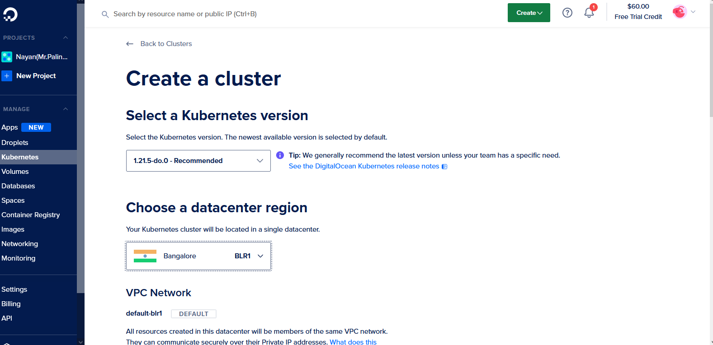

# Deploy-scalable-NoSQL-database-cluster
## Introduction
I have deployed a NoSQL cluster on Kubernetes. And below I have explained how I did that. First of all, you need some prerequisites, you need to have a Digitalocean account, and you need to know what is Kubernetes. You can look into this doc of Kubernetes: https://kubernetes.io/docs/concepts/overview/what-is-kubernetes/
You also need to have kubectl and doctl you can see their documentation on how to install them in your system.
### Create a Kubernetes Cluster on DigitalOcean

We need to use  DigitalOcean's control paned to create the cluster

 
<br>
Then choose datacenter region as Bangalore, you can choose anyone. And left everything untouched.
<br>
 
 

Then press "create". It will take about few minutes to set up.
After set up write the command below in your terminal or powershell or directly paste it from "Getting started: Connecting to Kubernetes"
```
doctl kubernetes cluster kubeconfig save <kubeconfig>
```
 

Now we have to apply all the config files.
But you need to clone my repo of all config files. Use following command to clone it:
```
git clone https://github.com/mr-palindrome/Deploy-scalable-NoSQL-database-cluster/
```
Then get inside the folder and change the credentials in mongodb-secrets.yaml (Note: Use base64 to encode your username and password first)
Now run the following command to apply all the configuration files.
```
kubectl apply -f .
```
Now  check the services to see is mongodbclient is running or not
```
kubectl get all
```
 

Now the mongodb cluster is running
now type:
```
kubectl exec deployment/mongo-client -it -- /bin/bash
```
 

Now we will get access our mongo client.
After getting access we can gain access to mongo shell via noodeport or directly to mongo shell via your localhost.
Use the following commands:
```
mongo --host mongo-nodeport-svc --port 27017 -u username -p password
```
or
```
mongo
```
 

## License
Apache 
